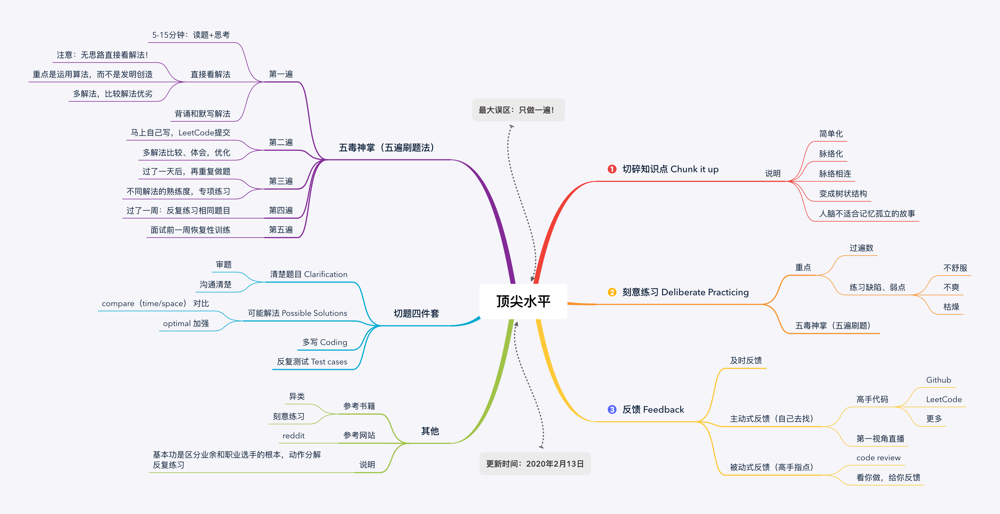
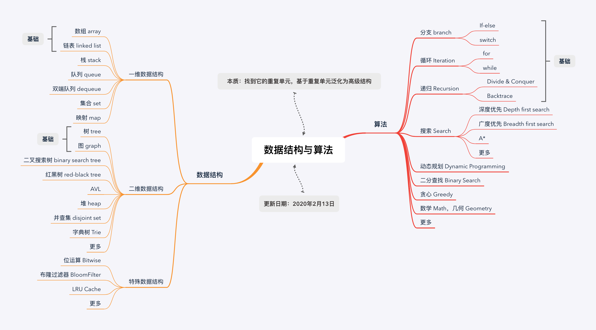

# 目录

- [第一课数据结果与算法总览](#第一课数据结果与算法总览)
- [第二课训练准备和复杂度分享](#第二课训练准备和复杂度分享)

# 第一课数据结果与算法总览

## 脑图

# 第二课训练准备和复杂度分享

## 脑图

# 预习

## 为什么数组要从 0 开始编号，而不是从 1 开始呢？

1、历史原因，从C开始设计就从0开始
2、物理地址=首地址+偏移量，0会多一步减法运算
数组和链表：
1、线性表：数组、链表、队列、栈
2、非线性表：树、图
3、数组支持随机访问，且按下标随机访问 O(1)
4、我们并不一定非得追求数组中数据的连续性。如果我们将多次删除操作集中在一起执行，删除的效率是不是会提高很多呢？
为了避免 d，e，f，g，h 这几个数据会被搬移三次，我们可以先记录下已经删除的数据。每次的删除操作并不是真正地搬移数据，只是记录数据已经被删除。
当数组没有更多空间存储数据时，我们再触发执行一次真正的删除操作，这样就大大减少了删除操作导致的数据搬移。
如果你了解 JVM，你会发现，这不就是 JVM 标记清除垃圾回收算法的核心思想吗？没错，数据结构和算法的魅力就在于此，很多时候我们并不是要去死记硬背某个数据结构或者算法，而是要学习它背后的思想和处理技巧，这些东西才是最有价值的。
5、经典的链表应用场景，那就是 LRU 缓存淘汰算法
缓存的大小有限，当缓存被用满时，哪些数据应该被清理出去，哪些数据应该被保留？这就需要缓存淘汰策略来决定。常见的策略有三种：先进先出策略 FIFO（First In，First Out）、最少使用策略 LFU（Least Frequently Used）、最近最少使用策略 LRU（Least Recently Used）。
6、三种最常见的链表结构，它们分别是：单链表、双向链表和循环链表
头结点用来记录链表的基地址。有了它，我们就可以遍历得到整条链表
6.1、单链表：head->data->end->NULL
6.2、循环链表是一种特殊的单链表：head->data->data->head
和单链表相比，循环链表的优点是从链尾到链头比较方便。当要处理的数据具有环型结构特点时，就特别适合采用循环链表
约瑟夫斯问题
6.3、双向链表：head<->data<->end->NULL
LinkedHashMap
6.4、双向循环链表：head<->data<->data<->head
7、LRU
我的思路是这样的：我们维护一个有序单链表，越靠近链表尾部的结点是越早之前访问的。当有一个新的数据被访问时，我们从链表头开始顺序遍历链表。
1.如果此数据之前已经被缓存在链表中了，我们遍历得到这个数据对应的结点，并将其从原来的位置删除，然后再插入到链表的头部。
2如果此数据没有在缓存链表中，又可以分为两种情况：
如果此时缓存未满，则将此结点直接插入到链表的头部；
如果此时缓存已满，则链表尾结点删除，将新的数据结点插入链表的头部。
现在我们来看下 m 缓存访问的时间复杂度是多少。因为不管缓存有没有满，我们都需要遍历一遍链表，所以这种基于链表的实现思路，缓存访问的时间复杂度为 O(n)。
实际上，我们可以继续优化这个实现思路，比如引入散列表（Hash table）来记录每个数据的位置，将缓存访问的时间复杂度降到 O(1)。
因为要涉及我们还没有讲到的数据结构，所以这个优化方案，我现在就不详细说了，等讲到散列表的时候，我会再拿出来讲。除了基于链表的实现思路，实际上还可以用数组来实现 LRU 缓存淘汰策略。

## 编写链表技巧：
1、理解指针或引用的含义
2、警惕指针丢失和内存泄漏
3、利用哨兵简化实现难度
利用哨兵简化编程难度(插入排序、归并排序、动态规划等)
把这种有哨兵结点的链表叫带头链表
4、重点留意边界条件处理
我经常用来检查链表代码是否正确的边界条件有这样几个：
4.1、如果链表为空时，代码是否能正常工作？
4.2、如果链表只包含一个结点时，代码是否能正常工作？
4.3、如果链表只包含两个结点时，代码是否能正常工作？
4.4、代码逻辑在处理头结点和尾结点的时候，是否能正常工作？
5、举例画图，辅助思考
6、多写多练，没有捷径

## 跳表（Skip list）
Redis 中的有序集合（Sorted Set）就是用跳表来实现的
那 Redis 为什么会选择用跳表来实现有序集合呢？
为什么不用红黑树呢？红黑树也可以实现快速的插入、删除和查找操作
1、链表加多级索引的结构，就是跳表
2、在跳表中查询任意数据的时间复杂度就是 O(logn)
实际上，在软件开发中，我们不必太在意索引占用的额外空间。在讲数据结构和算法时，我们习惯性地把要处理的数据看成整数，但是在实际的软件开发中，原始链表中存储的有可能是很大的对象，而索引结点只需要存储关键值和几个指针，并不需要存储对象，所以当对象比索引结点大很多时，那索引占用的额外空间就可以忽略了。
3、支持动态的插入、删除操作，而且插入、删除操作的时间复杂度也是 O(logn)
4、跳表是通过随机函数来维护前面提到的“平衡性”
5、Redis 为什么会选择用跳表来实现有序集合
Redis 中的有序集合是通过跳表来实现的，严格点讲，其实还用到了散列表。不过散列表我们后面才会讲到，所以我们现在暂且忽略这部分。如果你去查看 Redis 的开发手册，就会发现，Redis 中的有序集合支持的核心操作主要有下面这几个：
插入一个数据；删除一个数据；查找一个数据；按照区间查找数据（比如查找值在[100, 356]之间的数据）；迭代输出有序序列。
按照区间来查找数据这个操作，红黑树的效率没有跳表高。
跳表可以做到 O(logn) 的时间复杂度定位区间的起点
跳表也不能完全替代红黑树。因为红黑树比跳表的出现要早一些，很多编程语言中的 Map 类型都是通过红黑树来实现的。我们做业务开发的时候，直接拿来用就可以了，不用费劲自己去实现一个红黑树，但是跳表并没有一个现成的实现，所以在开发中，如果你想使用跳表，必须要自己实现。
