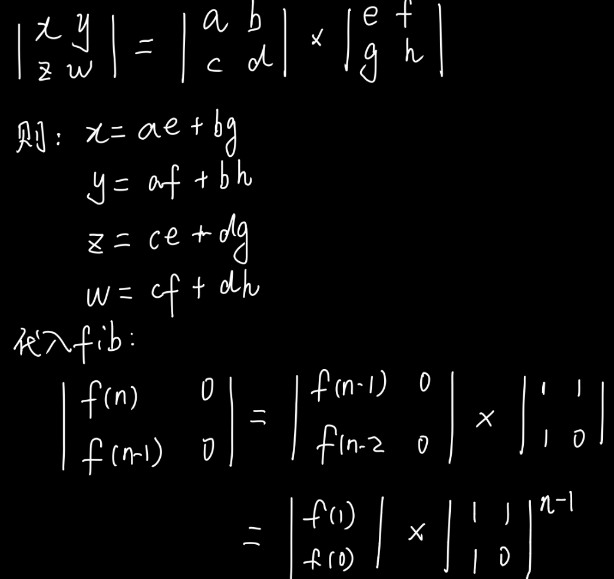

[TOC]

# 管中窥豹，斐波那契

## 自我介绍
- 大家好，我叫逄淑松，很荣幸能与大家一起交流
- 逄，pang，二声；淑是我的辈份
- 英文名或昵称：Pontus
- 语言：C++/C#, Go（Go新手，刷题语言）
- 工作：交易系统后端研发与管理
- 选题原因：
    - Fibonacci和爬楼梯问题是面试常考题，在课程中也屡次提及，今天我们一起梳理总结
    - 题目涉及的知识点比较全面，爬楼梯问题还有升级版，面试时可能被考察上限，**升级版代码绝对的独家一手分享(详细内容请见附件，走过路过千万不要错过呦)**
    - 相关的算法或理念也在实际工作有所体现

## Fibonacci
- [LeetCode Topic](https://leetcode-cn.com/problems/fibonacci-number/)
- Description
    > F(0) = 0,   F(1) = 1
    > F(N) = F(N - 1) + F(N - 2), 其中 N > 1.
    > 0 ≤ N ≤ 30
    > e.g. 0,1,1,2,3,5,8,13...

## Solution

### Recursion 递归
- [动画演示](https://visualgo.net/zh/recursion)
- 递归思路
    - 思考时不要一层层陷入
    - **可直接假定下一层调用(递)能够正确返回(归)**，然后在本层正常处理
    - 最后只需保证最深一层的逻辑，也就是递归的终止条件正确即可
- 代码

    ```c++
    //C++
    int fib(int n) {
        return n <= 1 ? n : fib(n-1) + fib(n-1);
    }
    ```

    ```go
    //以下代码均使用Go语言
    //Go中无三目运算符
    //TC: O(2^n), SC:O(n) - 递归调用栈的空间
    //AC, 12ms
    func recursionFib(n int) int {
        //terminator
        if n <= 1 {
            return n
        }
        //process
        //drill down
        return recursionFib(n-1) + recursionFib(n-2)
        //clear
    }
    ```
- 注意
    - 警惕堆栈溢出，如有需要主动计数并返回
    - 警惕重复计算（`Fib方案：Memorize 存储，如下`）
    - 可将递归代码写成递推代码
        - 递归，调用函数本身进行循环（从结束到开始归来）
        - 递推，迭代循环递推公式 （从开始到结束推导）（`Fib方案：DP 递推，如下`）

### Memorize 存储
- 加速
    - 升维：如索引
    - 空间换时间：如缓存
- 问题：递归方法有重复计算
- 方法：if n >= 2, 算过一次就存储起来，递归下次使用时直接取（缓存的概念，O(1)）
- 代码
    ```go
    //TC: O(n), SC: O(n)
    //AC, 0ms
    var hash = make(map[int]int)

    func memorizeFib(n int) int {
        if n <= 1 {
            return n
        }
        if _, ok := hash[n]; !ok {
            hash[n] = memorizeFib(n-1) + memorizeFib(n-2)
        }
        return hash[n]
    }
    ```

### DP 递推
- 动态规划
    - dp = recursion + memorize = transition 递归加记忆化就是递推，也就是动态规划
    - recursion: 下沉后，反向返回结果
    - transition: 正向递推
- 代码
    ```go
    //TC: O(n), SC: O(n)
    func dpFib(n int) int {
        //状态定义: dp[i], 累加到当前位置的结果值
        //初始值: dp[0], dp[1]
        //最终值: dp[n]
        //状态方程: dp[i]=dp[i-1]+dp[i-2]
        if n <= 1 {
            return n
        }
        dp := make([]int, n+1) //因为要使用n，所以长度是n+1
        dp[0], dp[1] = 0, 1
        for i := 2; i <= n; i++ {
            dp[i] = dp[i-1] + dp[i-2]
        }
        return dp[n]
    }
    ```
- 注意点
    - 动态规划可能涉及到空间的多余使用（`Fib方案：DP+Space Decrease 递推+空间缩减，如下`）

### DP+Space Decrease 递推+空间缩减
- 方法：dp[]存储了每个步骤的值，但最终结果只需比它小前两个的结果，所以可通过变量滚动
- 代码
    ```go
    //TC: O(n), SC: O(1)
    func dpSpaceFib(n int) int {
        //状态定义: prePre, pre
        //初始值: 0, 1
        //最终值: pre
        //状态方程: pre, prePre = prePre+pre, pre
        if n <= 1 {
            return n
        }
        prePre, pre := 0, 1
        for i := 2; i <= n; i++ {
            prePre, pre = pre, prePre+pre
        }
        return pre
    }
    ```

### Formula 通项公式法
- 公式法举例
	```
    //1+2+3+4=10
	n := 4
	sum1 := 0
	for i := 1; i <= n; i++ {
		sum1 += i
	}
	sum2 := n * (n + 1) / 2
	assert.Equal(t, 10, sum1) //O(n)
	assert.Equal(t, 10, sum2) //O(1)
    ```
- Fib公式（在此不书写md版公式）
    > f(n) = a1(b1)^n + a2(b2)^n
    b1 = (1 + √5)/2 (goldenRatio)
    b2 = (1 - √5)/2
    a1 = 1/√5
    a2 = -1/√5
    b2^n , b2是小于1的数，幂次会在最后四舍五入时省略
    最终结果：f(n) = (goldenRatio^n)/√5
- 结论
    - goldenRatio = (1 + √5)/2
    - f(n) = (goldenRatio^n)/√5
- 代码
    ```go
    //TC: O(logn), SC: O(logn) - math.Pow的实现
    func formulaFib(n int) int {
        goldenRatio := (1 + math.Sqrt(5)) / 2
        fn := math.Pow(goldenRatio, float64(n)) / math.Sqrt(5)
        return int(math.Round(fn))
    }
    ```

### Matrix 矩阵求幂
- 公式       

    

- 方案：求power(A,N)
- 结果：可见f(n)在最终的A[0,0]上
- 代码
    ```go
    func matrixFib(n int) int {
        if n <= 1 {
            return n
        }
        A := [2][2]int{
            {1, 1},
            {1, 0},
        }
        A = matrixPower(A, n-1)
        return A[0][0]
    }

    //x^n
    //method1: recursion + divide&conquer
    //power(a,n), a是正数，n是自然数，只需要考虑n的奇偶性
    //递归+分治，O(logn)
    func matrixPower(A [2][2]int, n int) [2][2]int {
        //terminator
        if n <= 1 {
            return A
        }
        //process
        //drill down
        R := matrixPower(A, n/2)
        //clear
        if n&1 == 1 {
            return multiply(A, multiply(R, R))
        }
        return multiply(R, R)
    }

    //线代公式
    func multiply(A [2][2]int, B [2][2]int) [2][2]int {
        x := A[0][0]*B[0][0] + A[0][1]*B[1][0]
        y := A[0][0]*B[0][1] + A[0][1]*B[1][1]
        z := A[1][0]*B[0][0] + A[1][1]*B[0][1]
        w := A[1][0]*B[0][1] + A[1][1]*B[1][1]

        A[0][0] = x
        A[0][1] = y
        A[1][0] = z
        A[1][1] = w

        return A
    }
    ```

### Table 查表法
- 代码
    ```go
    //leetcode: 0 <= n <= 30
    //TC: O(1) :)
    var fibs = [31]int{0, 1, 1, 2, 3,   
    5, 8, 13, 21, 34, 55, 89, 144, 233, 377,   
    610, 987, 1597, 2584, 4181, 6765, 10946,   
    17711, 28657, 46368, 75025, 121393, 196418,   
    317811, 514229, 832040}

    func tableFib(n int) int {
        return fibs[n]
    }
    ```

## Summary 管中窥豹

### 知识点汇总

#### 递归
- 递归思路
    - 思考时不要一层层陷入
    - 可直接假定下一层调用(递)能够正确返回(归)，然后在本层正常处理
    - 最后只需保证最深一层的逻辑，也就是递归的终止条件正确即可
- 对递归的优化：尾递归
    - 尾递归是指，在函数返回的时候，调用自身本身，并且return语句不能包含表达式
    - 这样，编译器就可以对尾递归做优化，使递归无论调用多少次，都只占用一个栈帧，栈不会增长，不会出现栈溢出
    ```go
    func tailRecursionFib(n int, b1, b2 int, c int) int {
        if n <= 1 {
            return n
        }
        if n == c {
            return b1 + b2
        }
        return tailRecursionFib(n, b2, b1+b2, c+1)
    }
    ```
- 递归警惕重复计算
#### 加速
- 加速
    - 升维：如索引
    - 空间换时间：如缓存
#### 位运算
- 举例
    - x & 1, 结果为0或1，来判断偶、奇（`Fib方案：Formula 通项公式法，如上`）
    - x = x & (x-1), 用于清零最低位的1，如面试题找x中有多少个1
    - x & -x，用于得到最低位的1，-x是取反加一
#### 动态规划
- 递归+记忆=递推，即动态规划
- 动态规划可能涉及降低空间使用
#### 爬楼梯问题
- [LeetCode Topic](https://leetcode-cn.com/problems/climbing-stairs)
- 区别Fibonacci
    - 爬楼梯n从1开始，斐波那次n从0开始
    - 爬楼梯题目的 i和n 分别要比斐波那契 多1
        - if n <= **2**
        - for i := **3**; i <= n; i++ {}
        - res := math.Pow(goldenRation, float64(**n+1**)) / math.Sqrt(5) 
        - A = pow(A, **n**)
- 升级
    1. 每次可以走1，2，3步
    2. 前后走的步数不能重复
    3. 每次走的步数是在一个数组里定义，且前后不重复
    
### 学习方法

#### TDD
- 学习方法：四步拆题 与 五毒神掌
- 其中, 在进行四步拆题时，与覃超老师不同的是，我会把测试用例提前，先写测试用例和边界，再进行编程，直观自动判断正确与否
- TDD, 测试驱动，单元测试，结构编程
    ```go
    func TestFib(t *testing.T) {
        //Fibonacci
        //0,1,1,2,3,5,8,13
        assert.Equal(t, 13, fib(7))
    }
    ```

## 附件
- 代码
    - [Fibonacci](https://github.com/pangshusong/algorithm006-class01/blob/master/Week_02/G20200343030373/LeetCode_509_373/LeetCode_509_373_test.go)
    - [Climb Stairs](https://github.com/pangshusong/algorithm006-class01/blob/master/Week_02/G20200343030373/LeetCode_70_373/LeetCode_70_373_test.go)
- 本文
    - [Geek.Pontus.Fib](https://github.com/pangshusong/algorithm006-class01/blob/master/Week_02/G20200343030373/geek_fib/fib.md)