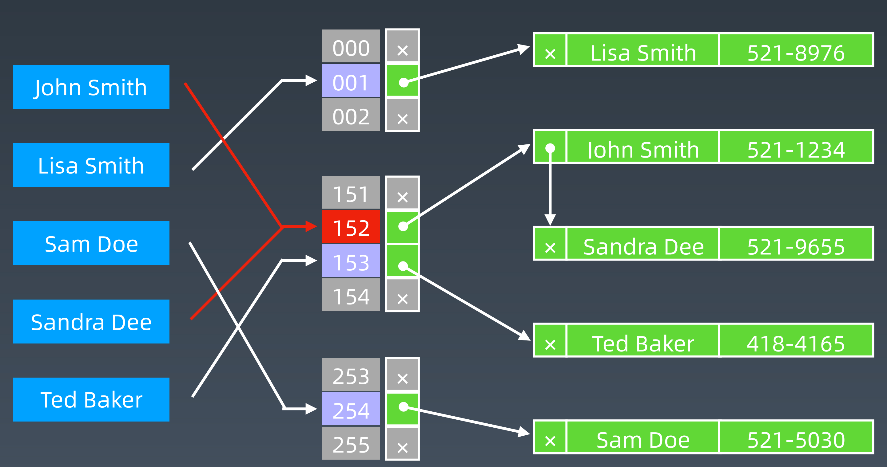
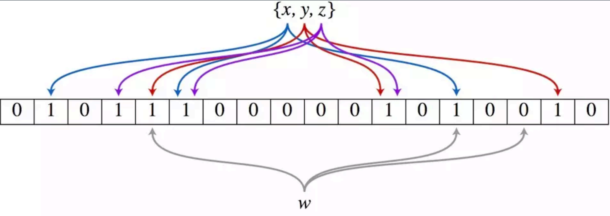
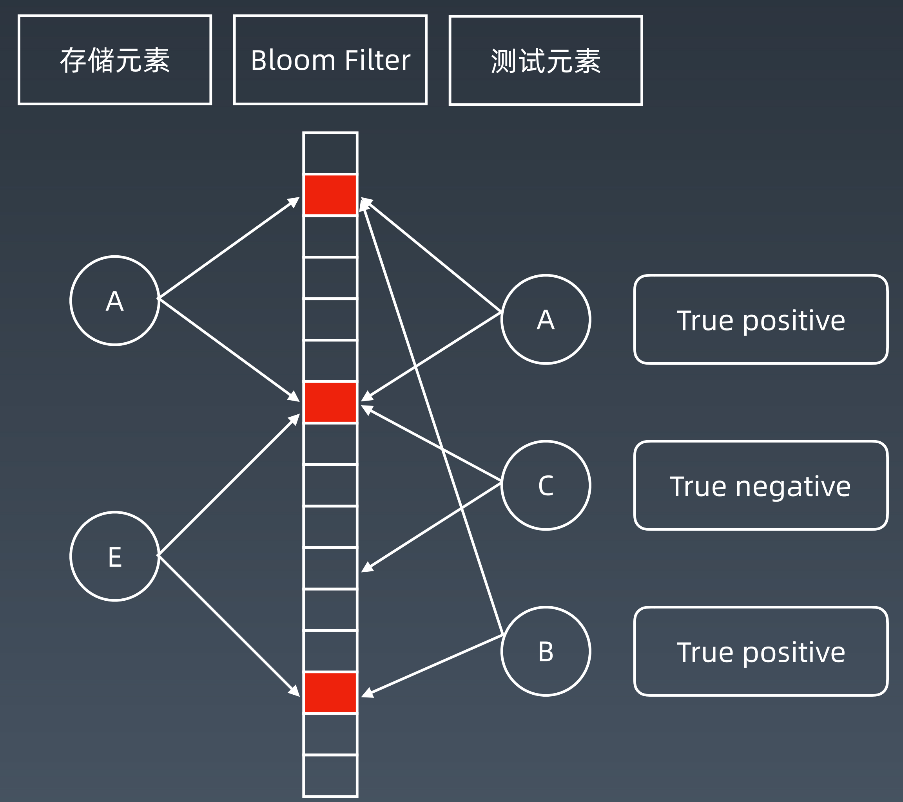

学习笔记
- 位运算符

    | 含义 | 运算符 | 示例 |
    | ---- |-------|-----|
    |左移  | <<    | 0011 => 0110  |
    |右移  | \>>    | 0110 => 0011 |
    |按位或 |  ︳   | 0011 &#124; 1011 = 1011  |
    |按位与  | & | 0011 & 0011 = 1011 | 
    |按位取反 | ~ | ~0011 = 1100
    |按位异或（相同为零不同为一）| ^ |0011 ^ 1000 =1011
- XOR -异或
    - 异或：相同为 0，不同为 1。也可用“不进位加法”来理解。
    - 异或操作的一些特点：
        - x ^ 0 = x
        - x ^ 1s = ~x // 注意 1s = ~0
        - x ^ (~x) = 1s
        - x ^ x = 0
        - c = a ^ b => a ^ c = b, b ^ c = a // 交换两个数
        - a ^ b ^ c = a ^ (b ^ c) = (a ^ b) ^ c // associative
- 指定位置的位运算
     1. 将 x 最右边的 n 位清零：x& (~0 << n)
     2. 获取 x 的第 n 位值（0 或者 1）： (x >> n) & 1
     3. 获取 x 的第 n 位的幂值：x& (1 <<n)
     4. 仅将第 n 位置为 1：x | (1 << n)
     5. 仅将第 n 位置为 0：x & (~ (1 << n))
     6. 将 x 最高位至第 n 位（含）清零：x& ((1 << n) -1)
     7. 将第 n 位至第 0 位（含）清零：x& (~ ((1 << (n + 1)) -1))
- 实战位运算要点
    - 判断奇偶：
        - x % 2 == 1 —> (x & 1) == 1
        - x % 2 == 0 —> (x & 1) == 0
    - x >> 1 —> x / 2. 
        - 即： x = x / 2; —> x = x >> 1;
        - mid = (left + right) / 2; —> mid = (left + right) >> 1;
    - X = X & (X-1) 清零最低位的 1 • X & -X => 得到最低位的 1 • X & ~X => 0

--------------------------
- 布隆过滤器、LRU Cache
    - 布隆过滤器 Bloom Filter
        - HashTable + 拉链存储重复元素
        
        - 一个很长的二进制向量和一系列随机映射函数。布隆过滤器可以用于检索一个元素是否在一个集合中。 
        - 优点是空间效率和查询时间都远远超过一般的算法， 
        - 缺点是有一定的误识别率和删除困难。
        - 布隆过滤器示意图
            
            